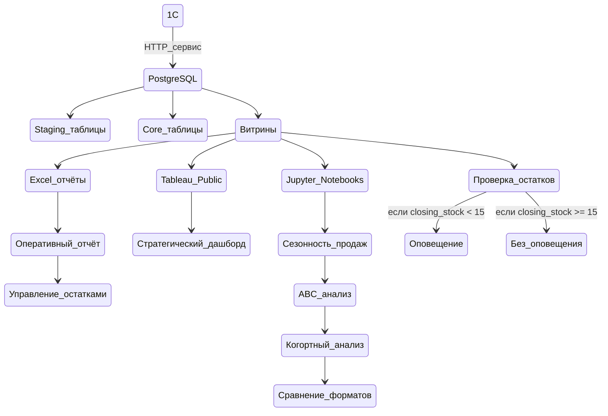

# Бриф проекта: Система аналитической отчётности — интернет-магазин книг

> В документе зафиксирован список предстоящей работы в рамках проекта.

## Контекст и проблема

Владелец интернет-магазина книг ежедневно вручную выгружает из 1С три отчёта — продажи, остатки и план — в CSV-файлы. Никакой автоматизации нет: история не накапливается системно, управленческих выводов из данных не извлекается. Решения принимаются «на глаз» по текущему срезу.

**Конкретные боли:**
- Ежедневная ручная выгрузка — рутина, которую легко пропустить или сделать с ошибкой.
- Нет сквозного взгляда: план, факт и остатки хранятся в разных файлах и никак не связаны.
- 1С показывает «сколько», но не отвечает на вопросы «почему» и «что дальше».
- Нет сигнала о критических событиях: о том, что книга заканчивается, узнают постфактум.

## Цель проекта

Построить систему, которая:
1. Автоматически накапливает историю продаж и остатков.
2. Даёт владельцу оперативные и стратегические инструменты управления без участия аналитика в рутинных задачах.
3. Сигнализирует о критических событиях (низкие остатки) автоматически.

### Стек проекта

| Задача                     | Инструмент                           |
| -------------------------- | ------------------------------------ |
| Хранилище данных           | PostgreSQL (локально)                |
| ETL, очистка, витрины      | Python: pandas, sqlalchemy, psycopg2 |
| Оперативный отчёт          | Excel + Power Query                  |
| Управление закупками       | Excel + Power Query                  |
| Стратегический дашборд     | Tableau Public                       |
| Аналитические исследования | Jupyter Notebook                     |
| Уведомления об остатках    | Python + Gmail SMTP                  |

## Архитектура системы

## Ход работы

### ШАГ 1. Создание базы данных в PostgreSQL

**В production** PostgreSQL был бы установлен на сервер (Linux/Windows) с созданием отдельных пользователей БД и настройкой прав доступа. Этапы в проде:

| Этап                         | Что происходит                                                                                                                         | Кто выполняет          |
| ---------------------------- | -------------------------------------------------------------------------------------------------------------------------------------- | ---------------------- |
| **1. Подготовка окружения**  | Устанавливается PostgreSQL на сервер (Linux/Windows). Настраиваются параметры: порт, кодировка UTF8, max_connections, буферы.          | DevOps / Администратор |
| **2. Создание пользователя** | Создаётся отдельный пользователь БД (не `postgres`) с ограниченными правами: `CREATE USER app_user WITH PASSWORD '...'`                | DBA / DevOps           |
| **3. Создание базы данных**  | `CREATE DATABASE project_db OWNER app_user ENCODING 'UTF8';`                                                                           | DBA / DevOps           |
| **4. Применение схемы**      | Выполняются SQL-скрипты создания таблиц, индексов, витрин. Обычно через миграции (Alembic, Flyway, Liquibase) или `psql -f schema.sql` | Разработчик / CI/CD    |
| **5. Настройка прав**        | Выдаются права на схему и таблицы: `GRANT SELECT, INSERT, UPDATE ON ALL TABLES IN SCHEMA public TO app_user;`                          | DBA                    |
| **6. Загрузка данных**       | Запускается ETL-скрипт (Python, dbt, Airflow), который загружает начальные данные.                                                     | ETL-разработчик        |
| **7. Автоматизация**         | Настраивается регулярный запуск обновлений (cron, Task Scheduler, Airflow, GitHub Actions).                                            | DevOps                 |

**Ключевые принципы в проде:**
- Никто не работает под пользователем `postgres` (суперпользователем).
- Пароли хранятся в секретах (не в коде).
- Все изменения БД версионируются через миграции.
- Ручное вмешательство минимально.

**В демо** процесс упрощён до минимальной работающей версии для демонстрации логики:

| Шаг   | Действие                                                                                                          |
| ----- | ----------------------------------------------------------------------------------------------------------------- |
| **1** | PostgreSQL установлен на локальный ПК (порт 5432, пароль задан при установке)                                     |
| **2** | База данных создана вручную одной командой: `CREATE DATABASE bookstore_ods;`                                      |
| **3** | Пользователь не создавался отдельно — используется встроенный `postgres` (для упрощения демо)                     |
| **4** | Таблицы и витрины создаются автоматически при первом запуске Python-скрипта (если таблиц нет — скрипт их создаёт) |
| **5** | Данные генерируются скриптом на Python и загружаются в БД                                                         |
| **6** | Для ежедневного обновления (15.04.2026) скрипт запускается вручную                                                |

### ШАГ 2. Генерация синтетических данных

**В production** данные поступали бы из 1C без скачивания файлов. 1С публикует данные через HTTP-сервис (REST API) → Python-скрипт забирает выгрузки ежедневно по расписанию и делает `INSERT` новых строк в PostgreSQL — база не перезаписывается, только пополняется. 

Так как подключение требует реальной инсталляции 1С с опубликованным HTTP-сервисом, в **демо** процесс эмулируется вручную. Скрипт `generate_data.py` создаёт синтетические данные с намеренными аномалиями и сохраняет их в формате csv-таблиц в папке `data/raw/`.

**Исходные данные и правила обновления:**

| Таблица          | Тип        | Содержание                                                                            | Обновление                                                                                                                        |
| ---------------- | ---------- | ------------------------------------------------------------------------------------- | --------------------------------------------------------------------------------------------------------------------------------- |
| `dim_product`    | Справочник | Продукты: книги (eBook, Paperback, Hardcover, Audiobook) и подписки (Monthly, Annual) | Редко: новые книги — `INSERT`, изменение цены или атрибутов — `UPDATE`, снятие с продажи — soft delete (флаг `is_active = false`) |
| `dim_date`       | Справочник | Календарь с атрибутами (год, квартал, месяц, день недели)                             | Раз в год, при необходимости `INSERT` новых дат                                                                                   |
| `fact_plan`      | План       | Плановые показатели по периодам                                                       | Раз в период: `INSERT` новых строк плана                                                                                          |
| `fact_sales`     | Факт       | Продажи                                                                               | Ежедневно: `INSERT` строк за прошедший день                                                                                       |
| `fact_inventory` | Факт       | Остатки на конец дня по физическим книгам                                             | Ежедневно: `INSERT` строк за прошедший день                                                                                       |

Фактовые таблицы продаж (`fact_sales`) и остатков (`fact_inventory`) разбиты на два периода:
- Выгрузка "исторических данных" о продажа и остатках: `sales_history` и `inventory_history` — содержат накопленные данные за 01.01.2024 - 14.04.2026 гг.
- Новая выгрузка продаж и остатков за 15.04.2026 — `sales_update` и `inventory_update`: файлы для симуляции ежедневного обновления базы данных.

### ШАГ 3. Проектирование витрин

Витрины — промежуточный слой между сырыми данными и инструментами отчётности. Логика агрегации описывается один раз в SQL и не дублируется в Excel, Tableau и Python по отдельности. Витрины пересчитываются при каждом обновлении данных.

| Витрина                    | Назначение                                                             |
| -------------------------- | ---------------------------------------------------------------------- |
| `01_mart_daily_pulse`      | Два слоя: `today` и `yesterday` — для оперативного отчёта с приростами |
| `02_mart_plan_fact`        | Выполнение плана на текущую дату (план × доля прошедших дней)          |
| `03_mart_inventory_alerts` | Товары ниже порога остатков                                            |
| `04_mart_sales_trends`     | Агрегированные продажи по периодам для дашборда                        |
| `05_mart_abc`              | ABC-классификация ассортимента                                         |
| `06_mart_margin`           | Маржинальность по форматам и издателям                                 |
| `07_mart_subscriptions`    | Метрики подписок                                                       |

Все витрины, кроме `mart_daily_pulse`, реализуются как **материализованные таблицы** (физические таблицы в PostgreSQL). Данные пересчитываются при каждом обновлении и сохраняются в обычных таблицах. `VIEW` оставлен только для `mart_daily_pulse`, потому что он должен всегда отражать последнюю дату в данных.

В `01_mart_daily_pulse.sql` витрина разбита на три таблицы для удобства подключения в Power Query:
- `mart_daily_pulse` — KPI,
- `mart_daily_breakdown` — разбивка по жанру/формату,
- `mart_daily_top5` — топ-5 товаров.

Отдельные SQL-скрипты:
- `schema.sql` — описывает создание таблиц в базе данных, запускается один раз при первоначальном развёртывании.
- `refresh_all_marts.sql` — пересчитывает все витрины данных в правильном порядке.

### ШАГ 4. Первичная загрузка данных в PostgreSQL

При первом запуске `load_history.py` выполняется сквозной процесс:
1. Создаются staging-таблицы (`schema.sql`).
2. Загружаются сырые данные из CSV (все файлы из `data/raw/`, кроме `sales_update.csv` и `inventory_update.csv`).
3. Выполняется очистка данных (`validate.py`) и сохраняется отчёт об аномалиях в `reports/`.
4. Запускаются все SQL-скрипты витрин (`refresh_all_marts.py`).

После загрузки база содержит данные по **14.04.2026 включительно**.

### ШАГ 5. Настройка обновления базы данных

В проде обновление базы возможно в двух вариантах:
- **По расписанию**: cron (Linux) или Task Scheduler (Windows) запускает `daily_update.py` ежедневно в заданное время. Владелец не участвует.
- **Ручной запуск:** владелец или аналитик запускает `daily_update.py` вручную — одной командой или кнопкой в интерфейсе.

В демо ежедневное обновление эмулируется с помощью скрипта `daily_update.py` и сгенерированных выгрузок продаж и остатков за 15.04.2026: `sales_update.csv` и `inventory_update.csv`.

При запуске скрипта выполняется сквозной процесс:
1) Загружаются сырые данные (`sales_update.csv` и `inventory_update.csv`).
2) Выполняется очистка данных (`validate.py`) и сохраняется отчёт об аномалиях в `reports/`.
3) Пересчитываются витрины данных.

После обновления база содержит данные на **15.04.2026**.

### ШАГ 6. Создание Excel-отчётов

Excel подключается к PostgreSQL напрямую через Power Query (без промежуточных файлов). Пользователь нажимает «Обновить всё» — Power Query делает запрос к БД и пересчитывает все листы.

1. `daily_pulse.xlsx` — оперативный отчёт. Открывается утром, показывает что изменилось за день. Источник данных: витрины `mart_daily_pulse` и `mart_plan_fact`.

	**Лист «Сегодня»**:
	- KPI-карточки: выручка, количество заказов, средний чек — каждая с Δ абс., Δ%, стрелкой ↑↓.
	- Выполнение плана на текущую дату: факт vs план-на-дату, % выполнения.
	- Разбивка план/факт по жанрам и форматам.
	- Топ-5 товаров дня по выручке.
	- Low-stock виджет: физические книги ниже порога (красная / жёлтая индикация).

2. `reorder_tracker.xlsx` — управление закупками. Источник данных: витрина `mart_inventory_alerts`.

	**Лист «К заказу»:**
	- Товары ниже порога: название, формат, текущий остаток, рекомендуемый заказ
	- Поля для заполнения: количество к заказу, поставщик, срок поставки, статус
	
	**Лист «История заказов»:**
	- Архив размещённых заказов (заполняется вручную)

### ШАГ 7. Создание дашборда в Tableau Public

Смотрится раз в неделю для анализа тенденций и стратегических решений.

Tableau Public не поддерживает прямое подключение к базам данных — это техническое ограничение платформы. В production используется Tableau Desktop с нативным подключением к PostgreSQL. Для демо-версии данные буду экспортированы в CSV в папку `data/exports/` — Tableau читает данные оттуда.

Дашборд статичный: данные на 15.04.2026, обновление не реализовано — это зафиксировано, как ограничение демо-версии.

**Страницы дашборда:**
1. **Обзор продаж** — выручка и заказы: динамика по месяцам, сравнение периодов, структура по жанрам и форматам.
2. **Остатки** — динамика остатков по категориям, топ товаров с критически низким запасом, карта остатков по жанрам.
3. **Ассортимент и маржинальность** — маржа по форматам (eBook / Print / Audiobook), рейтинг издателей по марже, ABC-анализ (классификация ассортимента по вкладу в выручку).
4. **Подписки** — динамика подписчиков (Monthly vs Annual), доля в выручке, средний срок жизни подписки.

**Фильтры на всех страницах**: период, жанр, формат, язык.

### ШАГ 8. Настройка автоматических уведомлений

`scripts/alerts.py` — запускается ежедневно по расписанию:
- Проверяет витрину `mart_inventory_alerts`
- Отправляет email-сводку если есть товары ниже порога

Стек: `smtplib` + Gmail SMTP. Не требует сервера — запускается на той же машине, что и основные скрипты.

### ШАГ 9. Проведение аналитических исследований

Jupyter-ноутбуки — для глубокого разового анализа. Результаты оформляются как выводы с визуализациями, не как операционные инструменты.

|Ноутбук|Содержание|
|---|---|
|`seasonality.ipynb`|Сезонность продаж по жанрам и форматам|
|`abc_analysis.ipynb`|ABC-анализ ассортимента с методологией|
|`subscription_cohorts.ipynb`|Когортный анализ подписчиков: удержание, LTV|
|`format_comparison.ipynb`|Сравнение форматов: маржа, оборачиваемость, сезонность|

## Лицензии и ограничения

- **PostgreSQL** — бесплатная СУБД с открытым исходным кодом (PostgreSQL License). Без ограничений на личное и коммерческое использование.
- **Tableau Public** — бесплатная платформа для публичных визуализаций. Все опубликованные дашборды доступны любому пользователю интернета. Для работы с конфиденциальными данными необходим Tableau Desktop (платный). Прямое подключение к базам данных доступно только в платных версиях Tableau.
- **Python и все используемые библиотеки** (pandas, sqlalchemy, psycopg2 и др.) — бесплатны, open source.
- **Microsoft Excel** — требует лицензии, Power Query входит в стандартную поставку.

---
*Версия: 4.0*